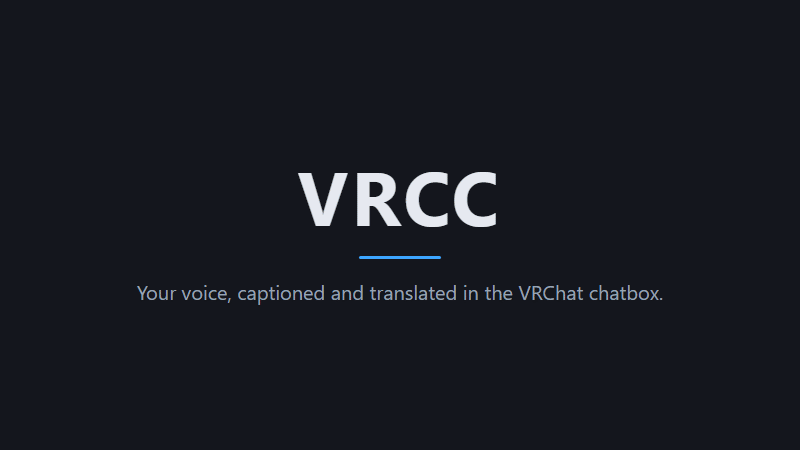
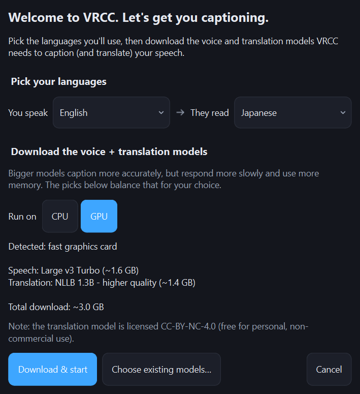
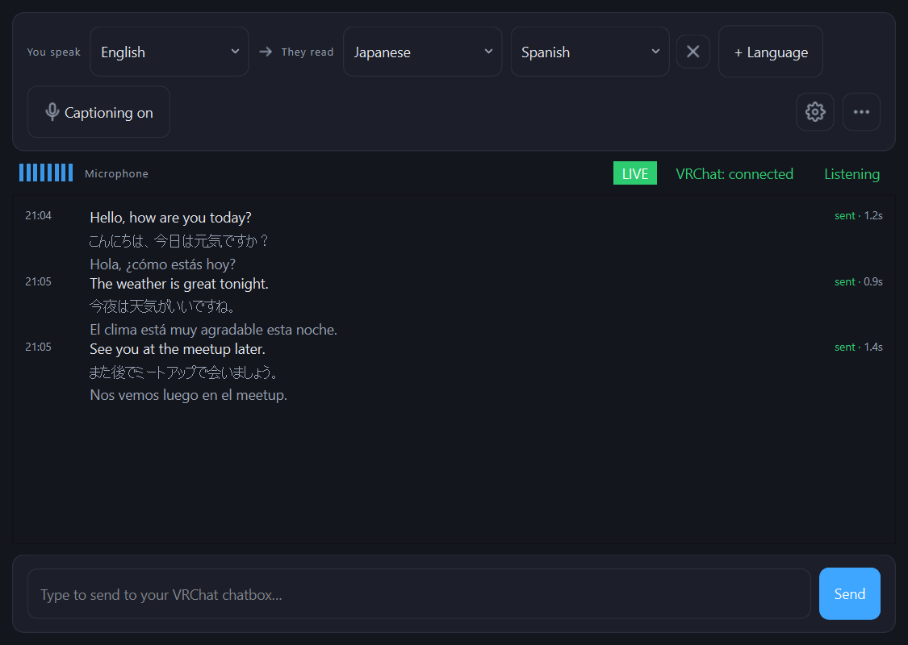

# VRCC

[English](README.md), [简体中文](README.zh-Hans.md), [日本語](README.ja.md)로도
볼 수 있습니다.

마이크에 대고 말하면 그 말이 VRChat 채팅박스에 실시간 자막으로 뜨고, 그 아래에 최대 세 개 언어의 번역이 함께 나옵니다. 모든 처리는 내 Windows 10 또는 11 PC 안에서 이루어집니다. 클라우드 서비스도 없고 API 키도 필요 없습니다.

```
You say:   "Hello, how are you today?"
Chatbox:   Hello, how are you today?
           こんにちは 今日はどうですか?
```

VRCC는 받아서 바로 쓸 수 있게 만들었습니다. 실행하면 첫 실행 마법사가 PC 사양을 살펴 모델을 고르고 성능 모드까지 정해 줍니다. 모든 추천은 추측이 아니라 실제로 측정한 벤치마크 결과에서 나온 것입니다. 세부 조정 항목은 설정에 그대로 있지만, 손댈 일은 없을 것입니다.



<a id="setup"></a>

<a id="get-vrcc-running"></a>

## VRCC 실행하기

5분쯤 걸리고, 여기에 한 번만 받으면 되는 모델 다운로드가 더해집니다. 설치할 Python도 없고 찾아야 할 API 키도 없습니다. 모든 것이 Windows 10 또는 11에서 로컬로 돌아갑니다.

<a id="download"></a>

1. Releases 페이지를 엽니다. 바로 실행할 수 있는 프로그램은 처음 들어가는 저장소 페이지에 없습니다.
   [Releases](https://github.com/dljr-github/VRCC/releases/latest) 안에 있습니다. 이 링크는
   가장 최신 릴리스로 바로 갑니다. 페이지에는 버전 번호와 릴리스 노트가 있고, 맨 아래에
   **Assets**라는 제목의 목록이 있습니다. 파일은 그 안에 들어 있습니다.

   Assets 아래 마지막 두 항목인 "Source code (zip)"과 "Source code (tar.gz)"는 프로그램이
   아니라 VRCC의 소스 코드입니다. 둘 다 건너뛰세요. 고를 대상은 `VRCC-cuda-windows-x64`와
   `VRCC-windows-x64` 두 개이고, 이름 뒤에 버전 번호가 붙어 있습니다.

2. 내 PC에 맞는 zip을 받으세요. `VRCC-cuda-windows-x64`는 CUDA 빌드로, VRAM이 8 GB 이상이고
   드라이버 570 이상인 NVIDIA 그래픽 카드를 위한 것입니다. 자막을 카드에서 계산하기 때문에
   거의 즉시 나타납니다. `VRCC-windows-x64`는 CPU 빌드입니다. 다운로드 용량이 훨씬 작고,
   8 GB 미만인 NVIDIA 카드, AMD나 Intel 그래픽, 그래픽 카드가 아예 없는 PC에서는 이쪽을
   받으면 됩니다. 자막 내용은 똑같고 잠깐 더 느릴 뿐이며, 기본 모델도 CPU에서 따라올 수 있는
   크기로 정해져 있습니다.

   내 PC에 무엇이 달려 있는지 보려면 Ctrl+Shift+Esc를 눌러 작업 관리자(Task Manager)를 열고
   **성능**(Performance) 탭에서 **GPU**를 클릭하세요. 카드 이름과 전용 메모리, 드라이버
   버전이 모두 그 화면에 있습니다. 굳이 확인하고 싶지 않다면 CUDA zip을 받으세요. 용량은 더
   크지만, 쓸 수 있는 카드를 찾지 못하면 알아서 프로세서로 실행합니다.

   GPU 가속은 지금은 NVIDIA 카드만 지원합니다. 여기에 테스트할 AMD 하드웨어가 없기
   때문입니다.

3. zip의 차단을 해제한 다음 압축을 푸세요. 내려받은 파일을 오른쪽 클릭하고 메뉴 맨 아래에
   있는 **속성**(Properties)을 고릅니다. 일반(General) 탭 아래쪽에 **차단 해제**(Unblock)
   체크박스가 있으면 체크하고 확인을 누르세요. Windows는 인터넷에서 온 파일에 표시를 해
   두는데, 여기서 그 표시를 지워 두면 다음 단계의 경고도 넘길 수 있습니다.

   그다음 zip을 다시 오른쪽 클릭하고 **압축 풀기**(Extract All)를 고르세요. 탐색기는 zip을
   폴더처럼 보여 주지만, 그 안에서 프로그램을 실행하면 Windows에 파일 하나만 건네지기 때문에
   실행되지 않습니다. 문서 폴더 같은 곳을 골라 풀면 `VRCC.exe`가 들어 있는 VRCC 폴더가
   생깁니다. 그 폴더는 통째로 두고 원하는 위치에 놓으세요. 따로 설치할 것은 없습니다.

4. `VRCC.exe`를 실행하세요. 방금 압축을 푼 폴더에서 더블 클릭합니다. Windows가
   "Windows의 PC 보호"(Windows protected your PC)라는 파란 상자를 띄울 수 있습니다. 메시지
   아래의 작은 링크인 **추가 정보**(More info)를 클릭한 다음, 그때 나타나는
   **실행**(Run anyway) 버튼을 누르세요. VRCC는 코드 서명이 되어 있지 않아서, Windows는 많이
   보지 못한 프로그램에 이 안내를 띄웁니다. 위의 Releases 페이지에서 받은 파일이라면 이
   상자는 눌러 넘길 만하지만, 다른 곳에서도 그렇게 하라는 뜻은 아닙니다. 조금 전에 차단
   해제를 체크했다면 아예 나타나지 않을 수도 있습니다.

5. 첫 실행 마법사가 모델을 내려받게 두세요. VRCC를 처음 실행하면 마법사가 PC를 확인해서
   음성 인식 모델과 번역 모델을 골라 주고(받을 용량은 대략 1 GB에서 3 GB), 이어서 내려받습니다.
   시작하기 전에 실행 장치나 모델을 바꿀 수 있습니다. 이 과정은 한 번만 거칩니다. 무엇을 왜
   고르는지는 [첫 실행](#first-run)의 표에 있습니다.

6. VRChat에서 OSC를 켜세요. **Action menu → Options → OSC → Enabled**를 엽니다. VRCC는
   OSC로 VRChat에 자막을 보내며(기본 주소 `127.0.0.1:9000`), 이것을 켜지 않으면 자막이
   채팅박스까지 가지 않습니다.

7. 마이크와 언어를 고르세요. VRCC에서 **마이크**와 **말하는 언어**(내가 쓰는 언어), 번역할
   **대상 언어 최대 세 개**를 고릅니다.

8. 말을 시작하세요. 내 말이 VRChat 채팅박스에 실시간 자막으로 뜨고 그 아래에 번역이
   따라옵니다. 창 아래쪽 입력란에 글을 써서 같은 방식으로 보낼 수도 있습니다.

나중에 **설정**(Settings)을 열면 인터페이스 언어를 바꾸거나 모델을 교체하고, 속도 모드와 품질 모드를 전환할 수 있습니다. [사용법](#usage)에는 VRCC로 평소에 하게 되는 나머지 내용이 있고, 자막이 도무지 나오지 않는다면 [문제 해결](#troubleshooting)부터 보세요. 소스에서 빌드하는 것은 기여하려는 개발자를 위한 내용입니다([DEVELOPING.md](DEVELOPING.md) 참고).

<a id="what-runs-on-your-machine"></a>

## 내 PC에서 돌아가는 것

내 목소리는 PC 밖으로 나가지 않습니다. VRCC 뒤에는 클라우드 서비스가 없고, 붙여 넣을 API 키도 없습니다.

음성 인식은 [faster-whisper](https://github.com/SYSTRAN/faster-whisper)로 돌아가고, 유럽 언어에는 NVIDIA의 [Parakeet TDT 0.6B v3](https://huggingface.co/nvidia/parakeet-tdt-0.6b-v3)([onnx-asr](https://github.com/istupakov/onnx-asr)를 통해 ONNX로 내보낸 형태로 실행), 중국어와 일본어, 한국어, 영어에는 [SenseVoice-Small](https://huggingface.co/FunAudioLLM/SenseVoiceSmall)도 쓸 수 있지만 SenseVoice는 권장하지 않습니다. 기계 번역은 [CTranslate2](https://github.com/OpenNMT/CTranslate2)로 NLLB, M2M100, MADLAD 모델을 돌립니다. 마법사가 이 중에서 대신 골라 주며, 그 선택의 근거가 된 측정값은 [모델 고르기](#picking-a-model)에 있습니다.

<a id="first-run"></a>

## 첫 실행

설정된 모델을 아직 내려받지 않았다면 첫 실행 마법사가 열려서, 하드웨어와 (Windows 표시 언어에서 가져온) 말하는 언어에 맞춰 모델을 고르고 내려받습니다.

| 내 PC | 음성 인식 | 번역 | 다운로드 |
| ------ | -------- | ---- | -------- |
| VRAM 16 GB+ NVIDIA GPU | `large-v3-turbo` | `nllb-1.3B-int8` | ~3 GB |
| VRAM 11 GB에서 16 GB인 NVIDIA GPU | `large-v3-turbo` | `nllb-600M-int8` | ~2.3 GB |
| GPU 없음 또는 11 GB 미만 NVIDIA GPU, Parakeet가 지원하는 언어 | `parakeet-tdt-0.6b-v3` | `nllb-600M-int8` | ~1.3 GB |
| GPU 없음 또는 11 GB 미만 NVIDIA GPU, 그 밖의 언어 | whisper `small` | `nllb-600M-int8` | ~1.1 GB |

VRChat 자체가 카드의 비디오 메모리를 많이 씁니다. VRCC는 VRChat 몫으로 8 GB를 남겨 두고, 번역 모델이 쓸 몫까지 뺀 나머지에 맞춰 음성 모델 크기를 정합니다. `large-v3-turbo`에 8 GB가 아니라 대략 11 GB가 필요한 이유가 이것입니다. 그보다 적으면 VRChat이 함께 돌아갈 자리가 너무 부족해집니다.

일본어와 한국어, 중국어도 다른 언어와 같은 모델을 씁니다. Parakeet는 이 언어들을 지원하지 않기 때문에, GPU가 없거나 11 GB 미만 NVIDIA GPU인 PC는 Parakeet 대신 whisper `small`을 받습니다. `sense-voice-small`은 모델 창에 그대로 있고 크기도 훨씬 작지만(240 MB), 테스트에서 실제 VRChat 음성은 faster-whisper가 더 정확하게 받아썼기 때문에 더 이상 권장하지 않습니다.

마법사는 무엇을 골랐는지 보여 주고, 내려받기 전에 실행 장치를 바꿀 수 있게 해 줍니다.



그 밖의 선택지는 whisper `tiny`(~75 MB)부터 `large-v3`(~3 GB)까지 있고, NVIDIA의 `parakeet-tdt-0.6b-v3`(~690 MB, 아주 정확하고 빠름)도 있습니다. Parakeet는 영어와 그 밖의 유럽 언어 24개로 제한됩니다(일본어/한국어/중국어 없음). 번역 모델은 `m2m100-418M-int8`(~480 MB)부터 `madlad400-3b`(~3.5 GB)까지 있습니다. 측정된 자막 품질에서는 NLLB가 앞서기 때문에 추천에 쓰이고, M2M100 모델은 라이선스가 자유로운 대안입니다([모델 라이선스](#model-licenses) 참고). 모델은 나중에 **모델**(Models) 창에서 추가하거나 지울 수 있습니다. 측정된 정확도와 속도는 아래 [모델 고르기](#picking-a-model)를 보세요.

VRCC를 실행할 준비가 끝나면 메인 창이 열리고 그 옆에 설정 단계 패널이 함께 뜹니다. 자막 켜기, 음성 모델 로딩 완료, 내 목소리가 VRCC에 도달, VRChat이 네트워크에 나타남, OSC로 자막 나감까지 항목이 줄지어 있고, 스피커에서 잡히는 소리에 대한 선택 항목이 하나 더 있는데 이 항목은 나머지를 막지 않습니다. VRChat 항목은 OSC 서비스가 mDNS로 자신을 알렸다는 것만 확인할 뿐, 게임까지 무언가 도달했다는 뜻은 아닙니다. 그래서 mDNS를 막는 네트워크에서는 VRChat이 멀쩡히 돌아가는데도 이 항목이 체크되지 않은 채 남고, 그 상태가 이어지는 동안에는 패널이 실행할 때마다 계속 열립니다. 자막 항목은 반대 방향의 증거입니다. 자막이 전송되었다는 것은 증명하지만 VRChat이 받았다는 것은 증명하지 못합니다. OSC는 메시지가 도착했는지 확인해 주지 않기 때문입니다. 그리고 VRChat으로 보내기를 꺼 두면 이 항목은 패널이 요구하는 목록에서 빠집니다. 패널이 여전히 요구하는 항목이 모두 통과되고 나면 다음 실행부터는 열리지 않습니다. 그전에 닫으면 그 세션에서만 사라지고 다음 시작 때 다시 나타납니다. 항목 통과 여부와 상관없이, 패널에 있는 **다시 표시하지 않기** 버튼을 쓰면 그 대신 영구히 닫을 수 있습니다. 어느 쪽으로 닫든 설정의 간단 페이지에서 언제든 다시 불러올 수 있습니다.

<a id="usage"></a>

## 사용법

1. VRChat을 실행하고 OSC를 켜세요. **Action menu → Options → OSC → Enabled**.
2. VRCC를 실행하세요. 마이크와 말하는 언어, 번역할 대상 언어를 최대 세 개까지 고릅니다.
3. 말하세요. 마이크 소리에서 일정한 배경 소음을 먼저 걸러 내고(기본값은 켜짐), 발화를
   자동으로 나눈 뒤(Silero VAD) 받아쓰고 번역해서 채팅박스로 보냅니다. 전송은 VRChat
   채팅박스의 속도 제한 안에 머물도록 조절되므로, 쉬지 않고 말해도 게임 안의 스팸 뮤트에
   걸리지 않습니다. 세기를 낮추거나 끄려면 **설정 → 음성 인식 → 배경 소음 줄이기**에서
   조정하세요.
4. **다른 사람의 말 읽기:** 메인 창의 **상대 음성**(Hear others)을 켜면 스피커에서 나오는
   목소리를 받아쓰고 번역해 주기 때문에, 읽지 못하는 언어로 말하는 사람도 따라갈 수
   있습니다. 설정 → 간단 → 다른 사람의 말(What other people say)에서 듣는 스피커와 표시할
   언어를 고릅니다. 두 가지를 알아 두세요. Windows에는 앱별로 음성만 따로 가져오는 방법이
   없어서 VRChat의 음성 채널이 아니라 출력 장치 전체를 가져오고, 그래서 게임과 월드
   오디오까지 함께 받아쓰게 됩니다. 그리고 이 내용은 VRCC 창에만 표시됩니다. 다른 사람의
   말은 절대 채팅박스로 보내지 않습니다. 그 방에 있는 사람들은 이미 들었고, 그것을 옮기면
   남의 말을 내 이름으로 다시 퍼뜨리는 셈이 되기 때문입니다. 그래픽 카드가 없으면 음성 모델
   하나를 내 자막과 나눠 쓰기 때문에 양쪽 다 느려집니다.
5. **글로 보내기:** 메인 창 아래쪽 입력란에 쓴 글도 똑같이 번역 → 채팅박스 경로로
   전송됩니다(말하고 싶지 않을 때 쓸 만합니다).
6. **음소거 연동:** 켜 두면 VRChat에서 자신을 음소거했을 때 VRCC가 듣기를 완전히
   멈춥니다(무시하거나 반대로 동작하도록 설정할 수 있습니다). 음소거 중에 한 말은 아예
   캡처되지 않으므로, 문장 도중에 음소거를 풀면 푼 뒤에 한 말만 자막이 됩니다. 이 기능은
   VRChat의 OSCQuery 탐색을 쓰기 때문에 **VRChat이 같은 PC에서 돌아갈 때만**(localhost)
   동작합니다. 자막 자체는 그것과 상관없이 작동합니다.



<a id="interface-language"></a>

### 인터페이스 언어

인터페이스는 기본적으로 Windows 표시 언어를 따르며 18개 언어를 지원합니다(English, 日本語, 한국어, 简体中文, 繁體中文, Español, Français, Deutsch, Italiano, Português (Brasil), Русский, Українська, Polski, Nederlands, Türkçe, Bahasa Indonesia, Tiếng Việt, ไทย). 다른 언어를 고르려면 **설정 → 간단 → VRCC 표시 언어**에서 바꾸세요. 설정 창을 닫는 순간 적용됩니다. 이것은 VRCC 자체의 인터페이스에만 해당하며, 자막 언어는 메인 창에서 고릅니다.

<a id="performance-modes"></a>

### 성능 모드

**설정 → 간단 → 모드**는 두 가지 프리셋을 전환합니다.

- **속도**(기본값): 탐욕적 디코딩(beam 1)을 쓰고, 600 ms 동안 조용하면 자막을 확정합니다.
  자막이 가장 빨리 나옵니다.
- **품질**: beam 5를 쓰고 800 ms를 기다립니다. 표현이 눈에 띄게 좋아지고, 자막 하나당 약
  200 ms 느려집니다.

모드는 자막에만 영향을 줍니다. 번역은 **설정 → 번역 → 고급(미세 조정)** 아래에서 자체 탐색 폭을 따로 정합니다. 이 프리셋의 근거가 된 측정은 음성 인식만 다루고 번역에 대해서는 아무것도 말해 주지 않기 때문입니다.

모드를 바꾸면 고급 페이지의 멈춤 시간과 음성 인식 페이지의 탐색 폭을 덮어씁니다. 그 값들을 직접 손봐 둔 것이 있으면 VRCC가 어떤 값인지 알려 주고 먼저 물어봅니다. 두 모드를 오가며 비교하는 것만으로는 묻지 않습니다. 그 값은 내가 정한 것이 아니라 프리셋에서 온 것이기 때문입니다.

Parakeet와 SenseVoice는 항상 최고 정확도로 디코딩하기 때문에, 둘 중 하나가 활성 음성 모델이면 모드 항목이 회색으로 비활성화됩니다. 개별 항목(VAD 시간, beam 크기, 품질 기준 등)은 **설정 → 고급**에 있습니다.

<a id="picking-a-model"></a>

## 모델 고르기

이 절의 모든 수치는 `tools/bench_stt.py`에서 나왔습니다. [LibriSpeech](https://www.openslr.org/12/) test-clean 발화 100개를 앱이 쓰는 것과 같은 엔진 경로로 한 대의 PC(Windows 11, Ryzen 9 9950X3D, RTX 5090, 드라이버 610.62)에서 돌린 결과입니다. WER은 영어 낭독 음성의 단어 오류율이고, 지연 시간은 발화 하나를 받아쓰는 데 걸린 시간의 중앙값입니다. 정확도 수치와 상대적인 속도 비율은 다른 PC에도 그대로 적용되지만 절대적인 지연 시간은 그렇지 않습니다. 더 느린 CPU에서는 여기 나온 CPU 시간이 모두 비슷한 비율로 늘어난다고 보면 됩니다. 전체 표와 방법론은 [DEVELOPING.md](DEVELOPING.md#speech-to-text-benchmarks)에 있고, 다른 하드웨어에서 나온 수치는 [benchmarks/RESULTS.md](benchmarks/RESULTS.md)에 모여 있습니다.

NVIDIA GPU에서는 기본값 `large-v3-turbo`를 그대로 쓰세요. WER 1.7%로 `large-v3`와 같은 정확도를 내면서 약 3.5배 빨랐고, 모든 언어를 다룹니다.

CPU에서는 말하는 언어에 따라 다릅니다.

- 유럽 언어 25개 가운데 하나라면 `parakeet-tdt-0.6b-v3`을 쓰세요. 0.13 s에 2.3%를 기록해서
  기본값 `small`(0.74 s에 3.7%)을 정확도와 지연 시간 *양쪽 모두*에서 이겼고, 차이도 큽니다.
  그 범위 안에서는 말하는 언어를 스스로 감지하기까지 합니다.
- 일본어, 한국어, 중국어를 비롯해 그 범위 밖의 언어라면 `small`에 머무르세요. `small`을 이기는
  whisper 모델은 CPU에서 자막 하나에 몇 초씩 걸립니다.

Parakeet는 GPU보다 CPU에서 더 빠릅니다(0.13 s 대 0.21 s). int8 ONNX 그래프가 CUDA에 잘 맞지 않기 때문입니다. 그래서 Parakeet에는 CPU 빌드로 충분하고, 같은 PC에서 VRChat을 한다면 GPU를 통째로 게임에 넘겨 줄 수 있습니다. 장치를 자동(Auto)으로 두면 VRCC가 알아서 그렇게 합니다.

이번 측정에서 distil 모델들은 GPU에서는 `large-v3-turbo`에, CPU에서는 Parakeet와 `small`에 밀렸기 때문에 굳이 고를 이유가 별로 없습니다.

첫 실행 마법사는 하드웨어와 말하는 언어에 맞춰 골라 주며, 말하는 언어는 Windows 표시 언어에서 가져옵니다. CPU라면 Parakeet가 지원하는 언어를 쓸 때는 Parakeet를, 그렇지 않을 때는 `small`을 고른다는 뜻입니다. 말하는 언어를 자동으로 두면 whisper 모델에 머무릅니다. 어떤 언어일지 미리 알 수 없는데 유럽 언어만 되는 모델에 맡길 수는 없기 때문입니다.

<a id="where-things-are-stored"></a>

## 저장 위치

| 항목 | 기본 위치 |
| ---- | -------- |
| 설정 | `%LOCALAPPDATA%\VRCC\VRCC\config.json` |
| 모델 | `%LOCALAPPDATA%\VRCC\VRCC\models\` |
| 로그 | `%LOCALAPPDATA%\VRCC\VRCC\logs\vrcc-<date>-<time>.log` |

실행할 때마다 디버그 수준까지 전부 담긴 로그 파일이 하나씩 만들어지고, 최근 다섯 개가 보관됩니다. 문제를 신고할 때는 그 폴더에서 가장 최근 파일을 첨부하세요.

`--portable`로 실행하면 설정과 모델, 로그를 프로그램 자체 폴더에 보관합니다(USB 메모리에 넣어 다니거나 따로 떼어 설치할 때 편리합니다).

<a id="updating"></a>

## 업데이트

VRCC는 시작할 때 새 릴리스가 있는지 확인하고, 있으면 알림을 띄웁니다. 알림에는 브라우저에서 릴리스 페이지를 여는 버튼이 있습니다. 대신 내려받거나 바꿔 주지는 않으므로, 업데이트 방법은 처음과 같은 몇 단계입니다. 새 zip을 받아 차단을 해제하고 압축을 푼 다음, 새 폴더에서 `VRCC.exe`를 실행하면 됩니다.

설정과 내려받은 모델은 프로그램 폴더에 있지 않기 때문에(위 표 참고) 저절로 넘어갑니다. 모델을 다시 받지 않고, 첫 실행 마법사도 다시 나타나지 않습니다. 괜찮다는 확신이 들 때까지 예전 폴더를 남겨 두었다가 지우면 됩니다.

알림을 받고 싶지 않다면 **설정**을 열고 **고급**(Advanced / Power users) 페이지로 가서 **새 버전이 있으면 알려주기** 체크를 해제하세요.

포터블 설치는 반대입니다. `--portable`에서는 설정과 모델, 로그가 모두 프로그램 자체 폴더에 있으므로 그 폴더를 갈아치우면 함께 버려집니다. 먼저 `config.json`과 `models` 폴더를 새 폴더로 복사하거나, 새 빌드를 예전 폴더 위에 덮어쓰세요.

<a id="model-licenses"></a>

## 모델 라이선스

이 저장소의 **코드**와 VRCC가 내려받는 **모델**은 별개입니다. 모델의 라이선스가 내 용도에 맞는지 확인하세요.

- **NLLB** 모델(기본값 `nllb-600M-int8`, 그리고 1.3B와 3.3B): **CC-BY-NC-4.0**,
  *비상업적 용도만 허용*. 추천 모델이 이것이므로, VRCC를 상업적으로 쓴다면(유료 방송이나
  협찬 방송, 업무 사용) **모델** 창에서 M2M100 모델을 대신 고르세요.
- **M2M100** 모델(`m2m100-418M-int8`, 그리고 1.2B): **MIT**라서 그런 제한이 없습니다.
  VRChat에서 나올 법한 발화 60개를 일본어와 중국어, 한국어로 번역해 블라인드로 비교한 결과
  NLLB 600M보다 정확도가 낮았는데, 이것이 자유로운 라이선스와 맞바꾸는 부분입니다.
- **MADLAD-400**(`madlad400-3b`): **Apache-2.0**.
- Whisper 모델: **MIT**(OpenAI 가중치, SYSTRAN CT2 변환).
- **Parakeet**(`parakeet-tdt-0.6b-v3`): **CC-BY-4.0**(NVIDIA 가중치, istupakov ONNX 내보내기).
- **GTCRN**(*배경 소음 줄이기* 노이즈 제거 모델, 내려받지 않고 함께 들어 있음):
  **MIT**(Xiaobin Rong, https://github.com/Xiaobin-Rong/gtcrn).

<a id="troubleshooting"></a>

## 문제 해결

- **"No GPU detected"가 뜨거나 모든 것이 CPU에서 돌아감**: CUDA 빌드를 쓰고 있는지
  (`VRCC-cuda-windows-x64` zip, 또는 `pip install -e .[cuda]`로 설치한 소스), NVIDIA
  드라이버가 ≥ 570인지 확인하세요. GPU 가속은 지금은 NVIDIA 전용입니다(테스트할 AMD
  하드웨어가 없습니다). 그 밖의 경우에 CPU로만 도는 것은 정상입니다. 자막 내용은 같고 잠깐
  더 느릴 뿐이며, 기본 모델은 CPU에서 따라올 수 있는 크기입니다.
- **GPU의 VRAM이 모자람**: 엔진이 그 세션 동안 자동으로 CPU(int8)로 내려갑니다(자막은 같고
  지연 시간은 늘어납니다). GPU에 머무르려면 더 작은 모델을 고르세요.
- **VRChat에 자막이 나오지 않음**: VRChat에서 OSC를 켜고(Action menu → Options → OSC),
  VRCC 설정의 OSC 주소가 VRChat이 듣고 있는 곳과 맞는지 확인하세요(기본값
  `127.0.0.1:9000`). 다른 OSC 도구(예: OSCRepeater 같은 라우터)를 쓴다면 VRCC를 라우터의
  포트로 보내세요.
- **음소거 연동이 아무 일도 하지 않음**: VRChat이 *같은 PC*에 있어야 하고(localhost의
  mDNS/OSCQuery 탐색), 게임 안에서 OSC가 켜져 있어야 하며, 아바타가 `MuteSelf`를 보고해야
  합니다.
- **VRCC를 시작할 때 작은 화면이 나타남**: 그 화면은 VRCC가 무엇을 불러오는 중인지 알려
  주고, 보여 줄 것이 준비되면 닫힙니다. 업데이트나 재부팅 뒤 첫 실행은 더 느립니다. Windows가
  프로그램 파일을 디스크에서 처음 읽기 때문입니다. 실행이 도중에 죽으면 가장 최근 로그 파일에
  어디까지 갔는지 남아 있어서 신고할 때 도움이 됩니다.
- **첫 받아쓰기가 느림**: 시작 화면이 닫힌 뒤에도 창 안에서 모델 로딩과 예열이 이어집니다.
  그다음부터는 제 속도로 자막이 나옵니다.
- **버그 신고**: 위에 적힌 로그 폴더에서 가장 최근 파일을 첨부하세요. 실행마다 디버그 수준으로
  파일 하나가 기록되고 최근 다섯 개가 보관되므로, 타임스탬프가 가장 최근인 파일이 문제가 생긴
  실행입니다.
- **VRCC를 다시 실행해도 아무 일이 없음**: 한 번에 한 개만 실행되며, 다시 실행하면 이미 돌고
  있는 쪽에게 앞으로 나오라고 요청합니다. 그래도 나타나지 않으면 Windows가 마지막에 클릭한
  것에 포커스를 붙들고 있을 수 있으니 작업 표시줄 버튼을 보세요.
- **설정 단계가 다시 나오지 않음**: 패널을 닫으면 그 세션에서만 사라지고, 요구하는 항목이 모두
  통과되지 않았다면 다음 시작 때 다시 열립니다. 패널의 **다시 표시하지 않기** 버튼을 쓰면 그 대신
  영구히 닫을 수 있습니다. 어느 쪽이든 **설정 → 간단**을 열고 **설정 단계 다시 표시**를 쓰면
  바로 돌아옵니다.

<a id="developing"></a>

## 개발

소스에서 빌드하기와 테스트, 벤치마크, 패키징은 [DEVELOPING.md](DEVELOPING.md)에 있습니다.
