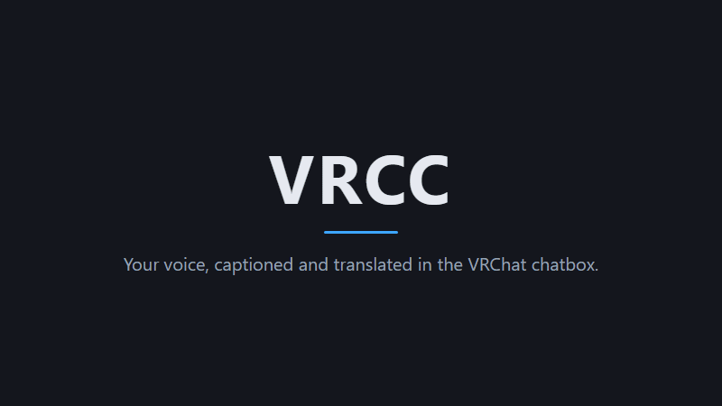
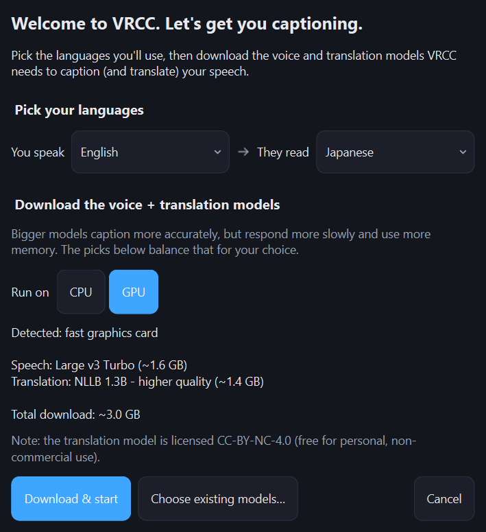
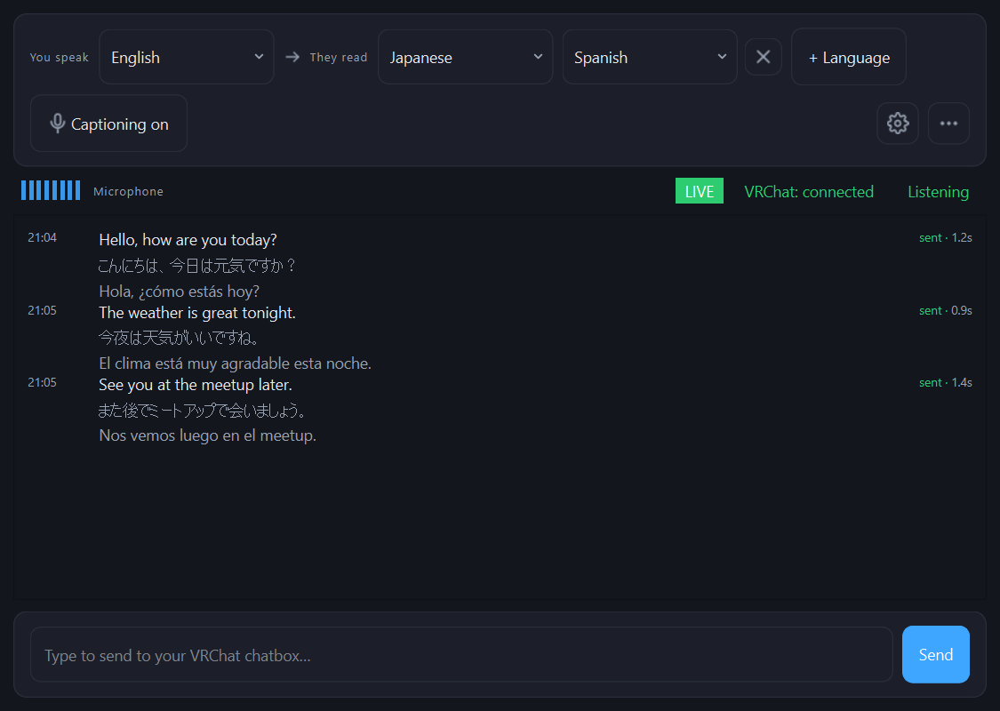

# VRCC

Speak into your microphone and your words appear in the VRChat chatbox as
live captions, with translations into up to three languages underneath.
Everything runs locally: speech recognition via
[faster-whisper](https://github.com/SYSTRAN/faster-whisper) or NVIDIA's
[Parakeet TDT 0.6B v3](https://huggingface.co/nvidia/parakeet-tdt-0.6b-v3)
(run as an ONNX export via [onnx-asr](https://github.com/istupakov/onnx-asr))
and machine translation via
[CTranslate2](https://github.com/OpenNMT/CTranslate2)
(NLLB / M2M100 / MADLAD models). No cloud services, no API keys.

```
You say:   "Hello, how are you today?"
Chatbox:   Hello, how are you today?
           こんにちは 今日はどうですか?
```

VRCC is built to be plug and play. Run it and the first-run wizard sizes
up your machine, picks the models, and sets the performance mode for you;
every recommendation traces back to a measured benchmark run rather than
a guess. The tuning knobs are still there in Settings, but you should not
need them.



## Setup

**Other languages:** [简体中文](#setup-zh) · [日本語](#setup-ja) · [한국어](#setup-ko)

Getting VRCC running takes about five minutes, plus a one-time model
download. There's no Python to install and no API keys — everything runs
locally on Windows 10 or 11.

1. **Check your hardware.** VRCC runs on any Windows 10/11 PC.
   - **NVIDIA GPU** (driver 570 or newer): use the CUDA build for
     near-instant captions.
   - **AMD/Intel graphics, or no GPU:** use the CPU build. Captions are
     identical, just a moment slower.

2. **Download the build for your hardware.** From the
   [latest release](https://github.com/dljr-github/VRCC/releases/latest),
   download the zip that matches:
   - `VRCC-cuda-windows-x64` — for NVIDIA GPUs. Falls back to CPU
     automatically if no usable GPU is found.
   - `VRCC-windows-x64` — the smaller, CPU-only download.

3. **Unzip and run `VRCC.exe`.** Unzip the folder anywhere and
   double-click **`VRCC.exe`**. There's nothing to install.

4. **Let the first-run wizard download the models.** The first time you
   launch VRCC, a wizard checks your machine and picks a speech-to-text
   model and a translation model for you (a ~1–3 GB download), then
   fetches them. You can switch the run device or the models before it
   starts. This only happens once.

5. **Enable OSC in VRChat.** In VRChat, open
   **Action menu → Options → OSC → Enabled**. VRCC sends captions to
   VRChat over OSC (default address `127.0.0.1:9000`); without this, they
   won't reach the chatbox.

6. **Choose your microphone and languages.** In VRCC, pick your
   **microphone**, your **source language** (the one you speak), and up to
   **three target languages** to translate into.

7. **Start talking.** Your words appear in the VRChat chatbox as live
   captions, with the translations underneath. You can also type into the
   box at the bottom of the window to send text the same way.

Later, open **Settings** to change the interface language, swap models, or
switch between Speed and Quality modes. Building from source is for
developers only — see [DEVELOPING.md](DEVELOPING.md).

<a id="setup-zh"></a>
<details>
<summary><b>安装步骤（简体中文）</b></summary>

<br>

让 VRCC 运行起来大约需要五分钟，另外还有一次性的模型下载。无需安装
Python，也不需要 API 密钥——所有功能都在本地的 Windows 10 或 11 上运行。

1. **确认你的硬件。** VRCC 可在任何 Windows 10/11 电脑上运行。
   - **NVIDIA GPU**（驱动 570 或更新版本）：使用 CUDA 版本，字幕几乎即时显示。
   - **AMD/Intel 显卡，或没有 GPU：**使用 CPU 版本。字幕内容完全相同，只是稍慢一点。

2. **下载适合你硬件的版本。** 前往[最新发布版本](https://github.com/dljr-github/VRCC/releases/latest)，下载与之匹配的 zip 压缩包：
   - `VRCC-cuda-windows-x64` —— 适用于 NVIDIA GPU。若未检测到可用的 GPU，会自动回退到 CPU。
   - `VRCC-windows-x64` —— 体积更小、仅使用 CPU 的版本。

3. **解压并运行 `VRCC.exe`。** 将文件夹解压到任意位置，然后双击 **`VRCC.exe`**。无需安装。

4. **让首次运行向导下载模型。** 首次启动 VRCC 时，向导会检测你的机器，并自动为你挑选一个语音识别模型和一个翻译模型（下载约 1–3 GB），然后开始下载。在下载开始前，你可以更改运行设备或所选模型。此步骤只需进行一次。

5. **在 VRChat 中启用 OSC。** 在 VRChat 中打开 **Action menu → Options → OSC → Enabled**。VRCC 通过 OSC 将字幕发送到 VRChat（默认地址为 `127.0.0.1:9000`）；若不启用，字幕将无法送达聊天框。

6. **选择麦克风和语言。** 在 VRCC 中，选择你的**麦克风**、你**所说的语言**（源语言），以及最多**三种目标语言**用于翻译。

7. **开始说话。** 你说的话会作为实时字幕出现在 VRChat 聊天框中，下方附有译文。你也可以在窗口底部的文本框中输入文字，通过相同方式发送。

之后，可打开**设置**更改界面语言、更换模型，或在**速度**与**质量**模式之间切换。从源代码构建仅面向开发者，请参阅 [DEVELOPING.md](DEVELOPING.md)。

</details>

<a id="setup-ja"></a>
<details>
<summary><b>セットアップ手順（日本語）</b></summary>

<br>

VRCC を使い始めるのにかかる時間は約5分、これに一度きりのモデルの
ダウンロードが加わります。Python のインストールも API キーも不要で、
すべて Windows 10 または 11 上でローカルに動作します。

1. **ハードウェアを確認します。** VRCC は Windows 10/11 の PC であれば動作します。
   - **NVIDIA GPU**（ドライバー 570 以降）：CUDA 版を使うと、字幕がほぼ即座に表示されます。
   - **AMD/Intel のグラフィックス、または GPU なし：**CPU 版を使います。字幕の内容は同じで、少し遅くなるだけです。

2. **お使いのハードウェアに合った版をダウンロードします。** [最新リリース](https://github.com/dljr-github/VRCC/releases/latest)から、環境に合った zip をダウンロードします。
   - `VRCC-cuda-windows-x64` — NVIDIA GPU 向け。使用可能な GPU が見つからない場合は、自動的に CPU にフォールバックします。
   - `VRCC-windows-x64` — サイズの小さい、CPU 専用のダウンロードです。

3. **解凍して `VRCC.exe` を実行します。** フォルダーを任意の場所に解凍し、**`VRCC.exe`** をダブルクリックします。インストールは不要です。

4. **初回起動ウィザードにモデルをダウンロードさせます。** VRCC を初めて起動すると、ウィザードがマシンを確認し、音声認識モデルと翻訳モデルを自動で選んで（約 1〜3 GB のダウンロード）取得します。開始前に、実行デバイスやモデルを変更することもできます。これは最初の一度だけです。

5. **VRChat で OSC を有効にします。** VRChat で **Action menu → Options → OSC → Enabled** を開きます。VRCC は OSC 経由で字幕を VRChat に送信します（既定のアドレスは `127.0.0.1:9000`）。有効にしないと、字幕がチャットボックスに届きません。

6. **マイクと言語を選びます。** VRCC で、**マイク**、**話す言語**（ソース言語）、そして翻訳先となる最大**3つのターゲット言語**を選択します。

7. **話し始めます。** 話した内容が VRChat のチャットボックスにリアルタイム字幕として表示され、その下に翻訳が付きます。ウィンドウ下部のテキストボックスに入力して、同じ方法でテキストを送ることもできます。

その後は、**設定**を開いて、インターフェースの言語を変更したり、モデルを切り替えたり、**速度**モードと**品質**モードを切り替えたりできます。ソースからのビルドは開発者向けです。詳しくは [DEVELOPING.md](DEVELOPING.md) を参照してください。

</details>

<a id="setup-ko"></a>
<details>
<summary><b>설치 방법 (한국어)</b></summary>

<br>

VRCC를 실행하기까지는 약 5분과 한 번만 받으면 되는 모델 다운로드가
필요합니다. Python 설치도, API 키도 필요 없으며 모든 처리는 Windows 10
또는 11에서 로컬로 실행됩니다.

1. **하드웨어를 확인하세요.** VRCC는 모든 Windows 10/11 PC에서 실행됩니다.
   - **NVIDIA GPU**(드라이버 570 이상): CUDA 버전을 사용하면 자막이 거의 즉시 표시됩니다.
   - **AMD/Intel 그래픽 또는 GPU 없음:** CPU 버전을 사용하세요. 자막 내용은 동일하며, 조금 더 느릴 뿐입니다.

2. **하드웨어에 맞는 버전을 다운로드하세요.** [최신 릴리스](https://github.com/dljr-github/VRCC/releases/latest)에서 해당하는 zip 파일을 다운로드합니다.
   - `VRCC-cuda-windows-x64` — NVIDIA GPU용. 사용할 수 있는 GPU가 없으면 자동으로 CPU로 전환됩니다.
   - `VRCC-windows-x64` — 용량이 더 작은 CPU 전용 다운로드입니다.

3. **압축을 풀고 `VRCC.exe`를 실행하세요.** 폴더를 원하는 위치에 압축 해제한 뒤 **`VRCC.exe`**를 더블클릭합니다. 설치할 것은 없습니다.

4. **첫 실행 마법사가 모델을 다운로드하도록 하세요.** VRCC를 처음 실행하면 마법사가 컴퓨터를 확인하여 음성 인식 모델과 번역 모델을 자동으로 선택하고(약 1~3 GB 다운로드) 내려받습니다. 시작하기 전에 실행 장치나 모델을 변경할 수 있습니다. 이 과정은 한 번만 진행됩니다.

5. **VRChat에서 OSC를 활성화하세요.** VRChat에서 **Action menu → Options → OSC → Enabled**를 엽니다. VRCC는 OSC를 통해 자막을 VRChat으로 보냅니다(기본 주소 `127.0.0.1:9000`). 이를 활성화하지 않으면 자막이 채팅박스에 도달하지 않습니다.

6. **마이크와 언어를 선택하세요.** VRCC에서 **마이크**, **말하는 언어**(원본 언어), 그리고 **번역할 대상 언어를 최대 세 개까지** 선택합니다.

7. **말을 시작하세요.** 말한 내용이 VRChat 채팅박스에 실시간 자막으로 표시되고 그 아래에 번역이 함께 나타납니다. 창 하단의 텍스트 상자에 입력하여 같은 방식으로 텍스트를 보낼 수도 있습니다.

이후에는 **설정**을 열어 인터페이스 언어를 변경하거나, 모델을 교체하거나, **속도** 모드와 **품질** 모드를 전환할 수 있습니다. 소스에서 빌드하는 것은 개발자를 위한 것입니다. 자세한 내용은 [DEVELOPING.md](DEVELOPING.md)를 참조하세요.

</details>

## Download

From the [latest release](https://github.com/dljr-github/VRCC/releases/latest),
grab the zip that matches your hardware, unzip it anywhere, and run
`VRCC.exe`. Windows 10/11; no Python setup needed. The first-run wizard
downloads the models for you.

- The CUDA zip (its name starts with `VRCC-cuda-windows-x64`) for PCs
  with an NVIDIA GPU (driver 570 or newer). Near-instant captions, and it
  falls back to CPU by itself when no usable GPU is found.
- The CPU zip (`VRCC-windows-x64`) is a much smaller download. Captions
  are identical, just a moment slower; the default models are sized to
  keep up on CPU.

GPU acceleration only supports NVIDIA cards at the moment (no AMD hardware
to test on). On AMD or Intel graphics, use the CPU build.

Installing from source is only for developers who want to contribute; see
[DEVELOPING.md](DEVELOPING.md).

## First run

If the configured models aren't downloaded yet, a first-run wizard opens,
picks models for your hardware and your spoken language (taken from your
Windows display language), and downloads them:

| Your machine | Speech-to-text | Translation | Download |
| ------------ | -------------- | ----------- | -------- |
| NVIDIA GPU with 16 GB+ VRAM | `large-v3-turbo` | `nllb-1.3B-int8` | ~3 GB |
| Otherwise, a language Parakeet covers | `parakeet-tdt-0.6b-v3` | `nllb-600M-int8` | ~1.3 GB |
| Otherwise | whisper `small` | `nllb-600M-int8` | ~1.1 GB |

The wizard shows what it picked and lets you switch the run device before
downloading.



Other options range from whisper `tiny` (~75 MB) up to `large-v3` (~3 GB),
plus NVIDIA's `parakeet-tdt-0.6b-v3` (~690 MB, very accurate and fast),
limited to English + 24 other European languages (no Japanese/Korean/Chinese).
MT models range from `m2m100-418M-int8` (~480 MB) up to `madlad400-3b`
(~3.5 GB). Models can be added/removed later via the **Models** dialog.
See [Picking a model](#picking-a-model) below for measured accuracy and
speed.

## Usage

1. Start VRChat and enable OSC: **Action menu → Options → OSC → Enabled**.
2. Start VRCC. Pick your microphone, source language and up to three
   target languages.
3. Talk. Utterances are segmented automatically (Silero VAD), transcribed,
   translated, and sent to the chatbox, throttled to stay inside VRChat's
   chatbox rate limit so continuous speech never triggers the in-game
   spam mute.
4. **Typed messages:** the text box at the bottom of the main window sends
   typed text through the same translate → chatbox path (useful when you'd
   rather not speak).
5. **Mute sync:** when enabled, muting yourself in VRChat makes VRCC stop
   listening entirely (configurable to ignore or invert). Speech made
   while muted is never captured, so unmuting mid-sentence captions only
   what you say after the unmute. This uses VRChat's OSCQuery discovery
   and works **only when VRChat runs on the same PC** (localhost);
   captioning itself works regardless.



### Interface language

The interface follows your Windows display language by default and can speak
18 languages (English, 日本語, 한국어, 简体中文, 繁體中文, Español, Français,
Deutsch, Italiano, Português (Brasil), Русский, Українська, Polski,
Nederlands, Türkçe, Bahasa Indonesia, Tiếng Việt, ไทย). Pick a different one
under **Settings → Simple → Language**; it applies as soon as the Settings
window closes. This only affects VRCC's own interface; caption languages are
chosen in the main window.

### Performance modes

**Settings → Simple → Mode** switches between two presets:

- **Speed** (default): greedy decoding (beam 1) and short silence
  thresholds. Captions appear fastest.
- **Quality**: beam 5 STT / beam 3 MT and slightly longer silence
  thresholds. Noticeably better phrasing, a few hundred milliseconds
  slower.

Parakeet always decodes at full accuracy, so the Mode control is greyed
out while it is the active voice model. The individual
knobs (VAD timings, beam sizes, quality gates and so on) live in
**Settings → Advanced**.

## Picking a model

Every figure in this section comes from `tools/bench_stt.py`: 100
[LibriSpeech](https://www.openslr.org/12/) test-clean utterances run
through the same engine path the app uses, on one machine (Windows 11,
Ryzen 9 9950X3D, RTX 5090, driver 610.62). WER is word error rate on
English read speech; latency is the median time to transcribe one
utterance. The accuracy numbers and the relative speed ratios carry over
to other machines; the absolute latencies do not. On a slower CPU, expect
every CPU time here to stretch by roughly the same factor. The full
tables and methodology are in
[DEVELOPING.md](DEVELOPING.md#speech-to-text-benchmarks), and
[benchmarks/RESULTS.md](benchmarks/RESULTS.md) collects numbers from
other hardware.

On an NVIDIA GPU, keep the default `large-v3-turbo`. It matched
`large-v3` at 1.7% WER while being about 3.5x faster, and it handles every
language.

On CPU it depends on the language you speak:

- One of the 25 European languages: use `parakeet-tdt-0.6b-v3`. It reaches
  2.3% at 0.13 s, beating the `small` default (3.7% at 0.74 s) on accuracy
  *and* latency, and it is not close. It also detects the spoken language
  on its own within that set.
- Japanese, Korean, Chinese, or anything else outside that set: stay on
  `small`. Every whisper model that beats it needs seconds per caption on
  a CPU.

Parakeet is faster on the CPU than on the GPU (0.13 s vs 0.21 s), because
its int8 ONNX graph does not suit CUDA. So the CPU build is enough for it,
and if you play VRChat on the same PC it leaves the whole GPU to the game.
VRCC does this for you when the device is left on Auto.

The distil models lost to `large-v3-turbo` on GPU and to Parakeet and
`small` on CPU in these runs, so there's little reason to pick them.

The first-run wizard picks for your hardware and your spoken language,
which it takes from your Windows display language. On a CPU that means
Parakeet when you speak a language it covers, and `small` when you do not.
Set the spoken language to Auto and it stays with the whisper models: with
no language known ahead of time, a European-only model cannot be trusted
to cover it.

## Where things are stored

| What | Default location |
| ---- | ---------------- |
| Config | `%LOCALAPPDATA%\VRCC\VRCC\config.json` |
| Models | `%LOCALAPPDATA%\VRCC\VRCC\models\` |
| Logs | `%LOCALAPPDATA%\VRCC\VRCC\logs\vrcc-<date>-<time>.log` |

Every run writes its own log file at full debug detail, and the five newest
are kept. When reporting a problem, attach the newest file from that folder.

Run with `--portable` to keep config, models and logs in the application's
own directory instead (handy on a USB stick or for isolated installs).

## Model licenses

The **code** in this repository is separate from the **models** it
downloads; check that a model's license fits your use:

- **NLLB** models (default `nllb-600M-int8`, plus 1.3B/3.3B):
  **CC-BY-NC-4.0**, *non-commercial use only*.
- **M2M100** models (`m2m100-418M-int8`, `m2m100-1.2B-int8`): **MIT**, a
  good alternative if you need a permissive license.
- **MADLAD-400** (`madlad400-3b`): **Apache-2.0**.
- Whisper models: **MIT** (OpenAI weights, SYSTRAN CT2 conversions).
- **Parakeet** (`parakeet-tdt-0.6b-v3`): **CC-BY-4.0** (NVIDIA weights,
  istupakov ONNX export).

## Troubleshooting

- **"No GPU detected" / everything runs on CPU**: make sure you're running
  the CUDA build (the `VRCC-cuda-windows-x64` zip, or a source install with
  `pip install -e .[cuda]`) and that your NVIDIA driver is ≥ 570. GPU
  acceleration is NVIDIA-only for now (no AMD hardware to test on).
  CPU-only operation is normal otherwise: captions are identical, just a
  moment slower; the default models are sized to keep up on CPU.
- **GPU runs out of VRAM**: the engines fall back to CPU (int8)
  automatically for the session (same captions, higher latency); pick a
  smaller model to stay on GPU.
- **VRChat isn't showing captions**: enable OSC in VRChat (Action menu →
  Options → OSC), and check the OSC address in VRCC's settings matches
  where VRChat listens (default `127.0.0.1:9000`). If you use other OSC
  tools (e.g. a router like OSCRepeater), point VRCC at the router's port.
- **Mute sync does nothing**: it requires VRChat on the *same machine*
  (localhost mDNS/OSCQuery discovery), OSC enabled in-game, and an avatar
  that reports `MuteSelf`.
- **First transcription is slow**: model load and warm-up happen once at
  startup; captions flow at full speed afterwards.
- **Reporting a bug**: attach the newest file from the logs folder above.
  Each run writes one file at full debug detail and the five newest are
  kept, so the file with the latest timestamp is the run that went wrong.

## Developing

Building from source, tests, benchmarks and packaging live in
[DEVELOPING.md](DEVELOPING.md).
